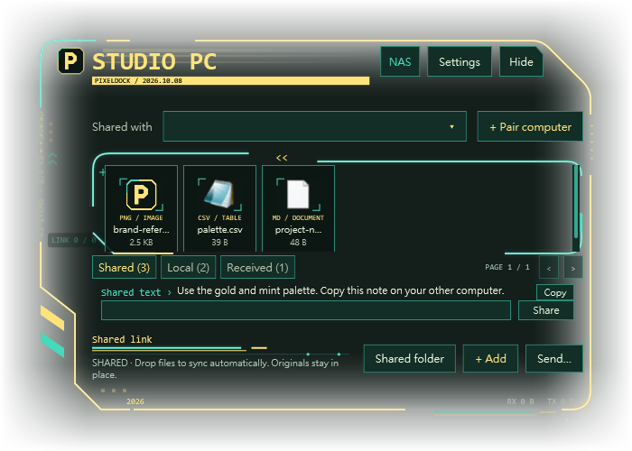
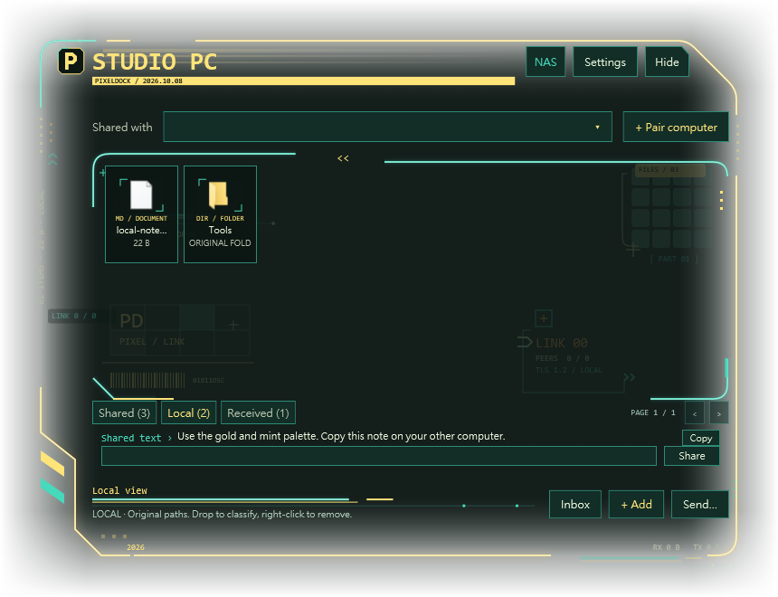
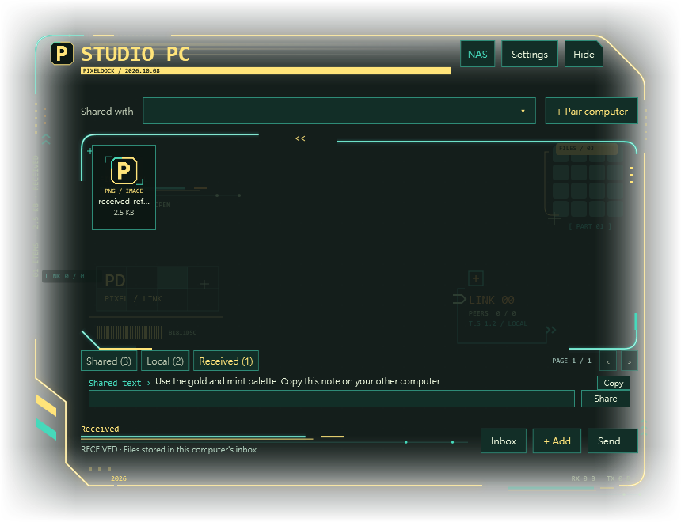
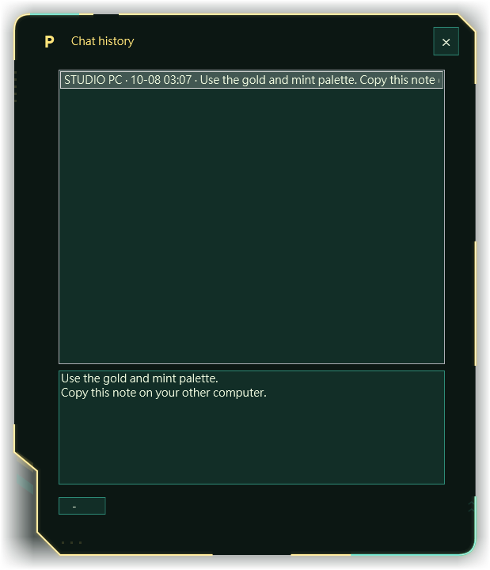
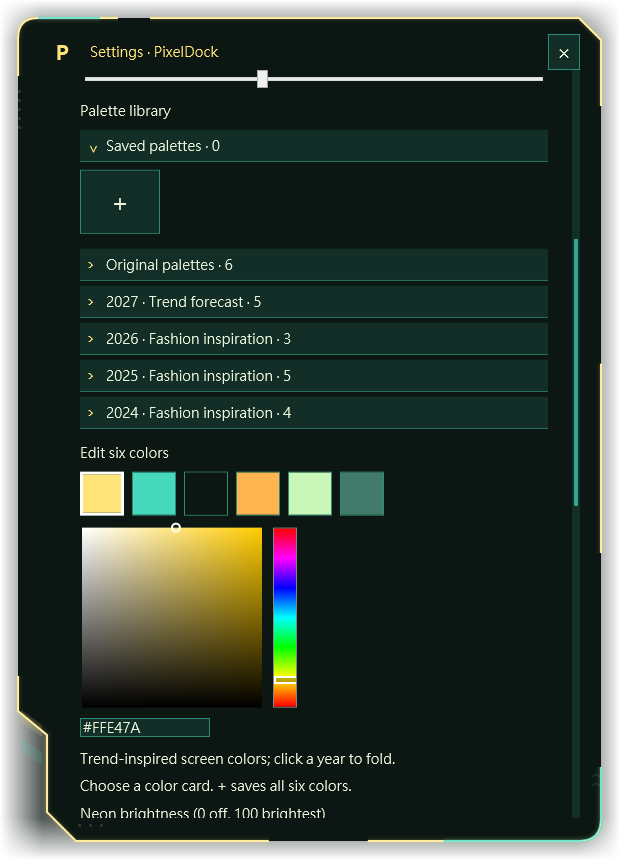
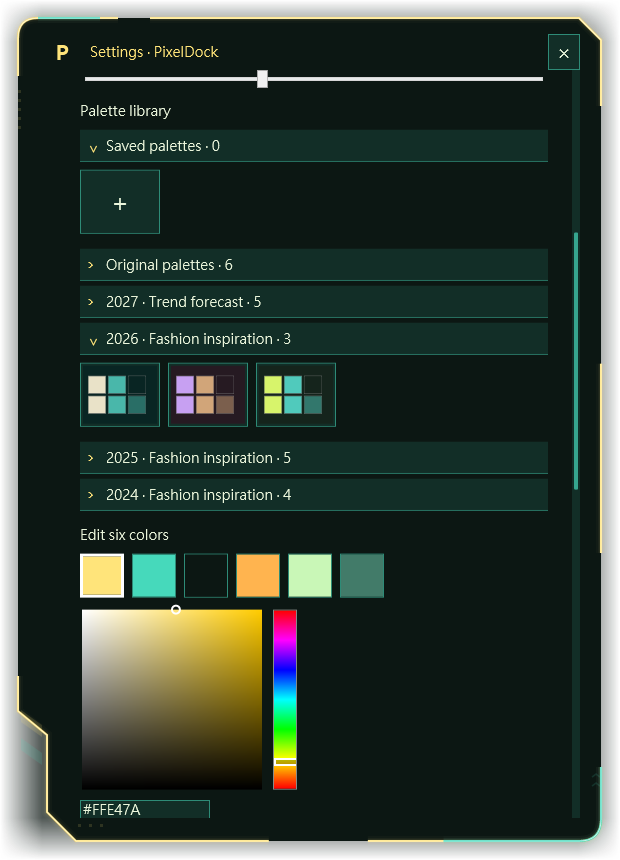
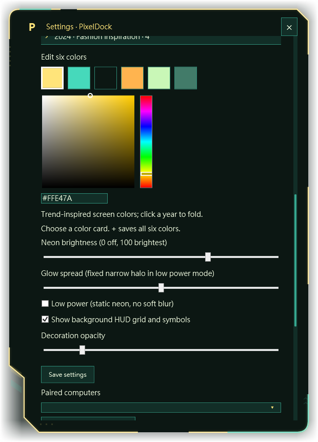
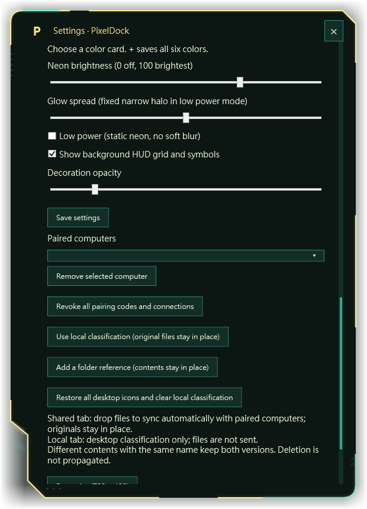
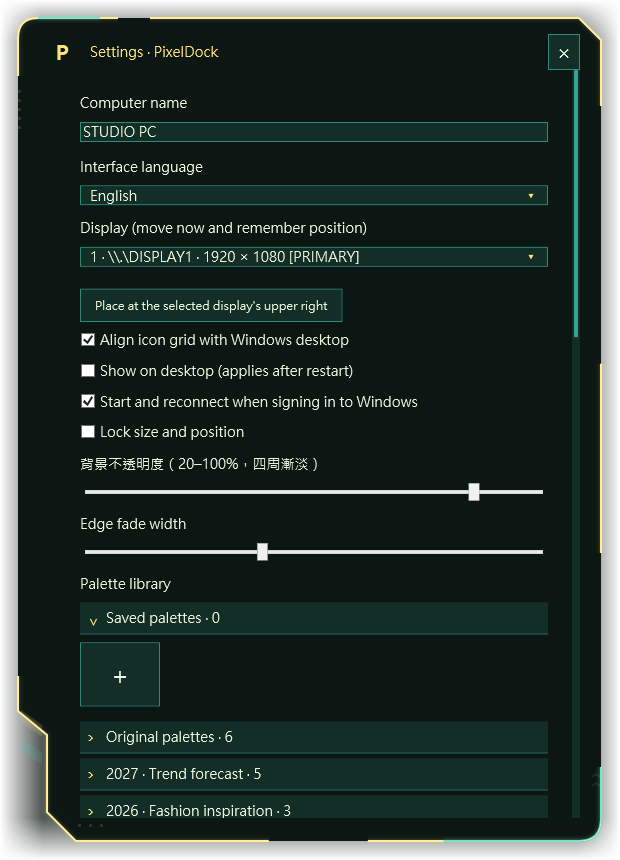
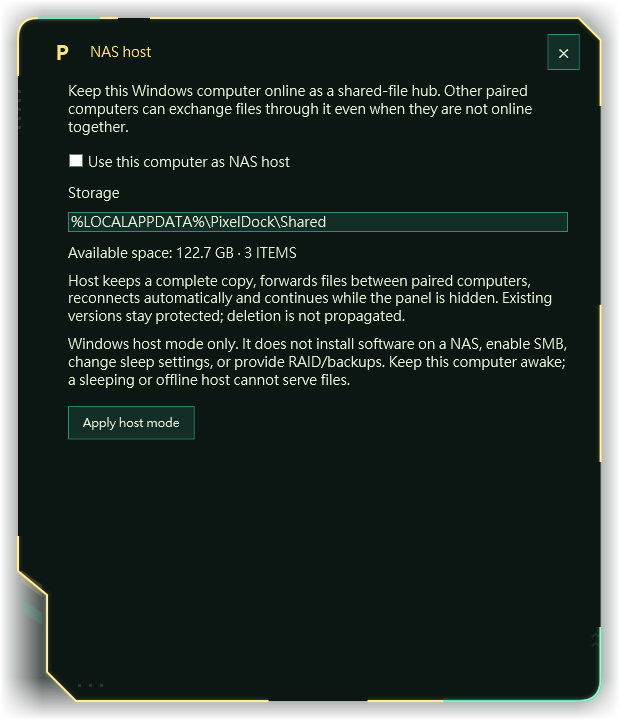

# PixelDock — User Guide

Version 1.5.7 · English · Updated October 8, 2026

Keep a shared file area on your Windows desktop. Pair your computers once, then drop files into Shared to synchronize them automatically.

## Install & start

1. **Install on both computers.** Obtain the PixelDock Windows package from its publisher, extract the ZIP, and run `PixelDock-Setup.exe`. Select **Install and open** (安裝並開啟). Installation is for your current Windows user and normally does not require administrator access.
2. **Connect to the same local network.** Ethernet and Wi-Fi can be mixed, as long as the computers can reach each other. Avoid guest networks that isolate devices.
3. **Pair once.** Open **+ Pair computer**, copy a code on one computer, and enter it on the other. See Pair computers for the exact steps.
4. **Use the Shared tab.** Drag a file into Shared. Keep PixelDock running on both computers and wait for **Auto-sync connected**.

**Check the result**

Open the file on the second computer. A connection indicator confirms a reachable peer; opening the received file confirms that your transfer finished.

### Before installing

- A Windows computer with **.NET Framework 4.7.2 or later in the 4.x family**. Follow [Microsoft’s installation instructions](https://learn.microsoft.com/en-us/dotnet/framework/install/) if the required runtime is missing.
- Enough free space for a full local copy of the files you share. Large files require space on every receiving computer.
- A reachable **private IPv4 local network**. PixelDock does not provide an Internet relay or cloud login.
- Windows firewall permission for PixelDock on your trusted **Private** network, if prompted.

### Switch the app to English

Open **Settings** (設定), find **Interface language** (介面語系), and choose **English**. The app also supports Traditional Chinese, Simplified Chinese and Japanese. The installer itself currently uses Chinese labels; this guide gives their English meanings.

## Your desktop dock

The compact dock keeps files above the small Share / Copy text row.

The large area is for files and tools. The compact text row is for sharing text that other paired computers can read and copy.

## Pair computers

Pair computer · Copy your code on one computer, then paste it on the other. The address shown here is an example; no working pairing code is pictured.

Pairing gives another computer access to your shared area. You only need to complete one successful pairing between two computers; the connection is saved in both directions.

1. **On computer A, open + Pair computer.** Choose the local network address belonging to the same router as computer B. If several addresses appear, avoid an unrelated VPN or virtual adapter.
2. **Select Copy my pairing code.** The complete code starts with `PD1-`. Send it privately to the person using computer B.
3. **On computer B, open + Pair computer.** Paste computer A’s complete code into the field for the other computer’s pairing code. Select the pairing action to add the computer as a transfer target.
4. **Confirm the paired name.** The dialog should report **Paired:** followed by the other computer’s name. Return to the dock and check the Shared connection status.

**Keep pairing codes private**

A code contains connection credentials. Do not post it in a public guide, screenshot or download package. Revoke all codes in Settings if one has been exposed.

### Reconnect after restarting

PixelDock retries connections to saved peers automatically. Both computers must be running the app, awake and reachable. If a computer’s local IP address changes, get a fresh pairing code from that computer and pair again to update its address.

### Remove a computer

In Settings, select it under **Paired computers** and choose **Remove selected computer**. Removing a peer does not erase files already copied to either computer. To invalidate all existing invitation codes and connections, use **Revoke all pairing codes and connections**; every computer will then need to pair again.

## Synchronize files

**Shared** is the automatic synchronization area. Files added here are copied to reachable paired computers. The peer selector does not restrict automatic Shared synchronization to only the selected computer.

1. **Choose Shared.** Check the active tab before adding a file. Dropping into Local organizes a reference instead of sharing it.
2. **Add your files.** Drag files into the file area, use **+ Add**, or open **Shared folder** and paste files there in File Explorer. PixelDock makes its own copy; the original source file stays in place.
3. **Leave PixelDock running.** The app detects changes in Shared, requests synchronization, and continues checking peers roughly every ten seconds. Transfer time depends on the network and file size.
4. **Verify on the other computer.** Open Shared on the second computer and double-click the file. The app checks transferred content with SHA-256 before accepting it.

### Working folder

`%LOCALAPPDATA%\PixelDock\Shared`

Press `Win` + `R`, paste this path, and press Enter to open the Shared folder for your current Windows user. This is an app-managed folder on each computer; it is not an SMB drive or a single network-mounted directory.

### When a peer is offline

Your copy stays on this computer. It can synchronize when the peer reconnects, provided a computer holding the file is still available.

### When a name already exists

Identical content is not copied twice under the same logical name. Different content with the same name is kept as a separate version, usually with a hash suffix.

### Edits, renames and deletion

- Editing an original file outside Shared does **not** update the separate copy already in Shared. Add the new version when ready to share it.
- Changes to files inside Shared are detected. Shared is intended for exchanging copies, rather than simultaneous editing of one document.
- Different revisions can remain alongside each other. Choose a current revision explicitly when collaborating.
- Deletion does **not** propagate. If another online peer still has a deleted file, it may be copied back to this computer. To remove a shared item everywhere, coordinate its removal from all computers holding a copy.
- Shared accepts individual files. ZIP a folder before sharing its contents; nested folder trees are not synchronized directly.

Limits: up to 20 GiB per file, displayed by the app as “20 GB,” and a maximum advertised inventory of 10,000 files per computer. Free-space checks reserve an additional 64 MiB. Keep extra working space for temporary copies.

## Local & Received

Local · Organize tools, folders and files in their original locations.

Received · Find files delivered by an explicit transfer.

| Area | What it contains | How it travels |
| --- | --- | --- |
| Shared | Copies in your PixelDock Shared folder. | Automatic synchronization with paired computers. |
| Local | References to files, folders and tools in their original locations. | No automatic transfer. Send an individual file explicitly if needed. |
| Received | Files delivered through an explicit transfer. | Stored in the receiving computer’s Inbox folder. |

### Organize files and tools locally

Select **Local** and drag in an item, or use **+ Add**. For a folder, use **Add a folder reference** in Settings. Double-click a tile to open its original item. A folder reference opens the folder without copying its contents.

Right-click a Local tile and choose **Remove from classification**, or focus it and press `Delete`, to remove the reference. The original file remains. When desktop icon classification is active, classified desktop icons can be hidden while the dock is shown; hiding or exiting the dock restores them.

### Send to one computer

1. **Select a paired computer.** Choose the intended destination in the peer selector.
2. **Send the file.** Right-click its tile and choose the action to send to the selected computer. The **Send…** action can also be used for a manual transfer.
3. **Check Received.** The recipient opens the Received tab or Inbox. Manual transfers require the destination to be online; use Shared for files that should synchronize after reconnection.

`%LOCALAPPDATA%\PixelDock\Inbox`

ZIP folders before sending them. An executable or script received from another computer may trigger an additional confirmation before it opens.

## Share & copy text

Shared text history · Select a message to view the full text, then copy it with its line breaks.

The compact text row is for a link, filename, short instruction or reusable text. It shares messages with all paired computers; selecting a peer does not make a message private to that peer.

1. **Enter or paste your text.** Use the small input below the file area. A message can contain up to 4,000 characters.
2. **Select Share or press Ctrl+Enter.** `Enter` inserts a new line. `Ctrl` + `Enter` sends the message. The app saves it locally and synchronizes it when peers are reachable.
3. **Copy it on the other computer.** The compact preview prioritizes the most recent message from another computer; if none exists, it shows the latest available message. Select **Copy** to copy the full text, including its line breaks.
4. **Open Shared text for older messages.** Select the **Shared text** heading to open the history, choose a message, and use Copy or select text in the read-only field.

**A preview is not the full message**

The small row flattens line breaks for display. Copy and the history dialog preserve the original message. PixelDock does not automatically read or replace your Windows clipboard; copying requires your action.

History is stored per Windows user and is limited to **512 messages** in version 1.5.7. Once full, new messages cannot be added. There is currently no in-app clear-history control. This row is intended for occasional shared text rather than continuous chat.

## Colors & glow

Palette library · Expand only the categories you want to browse.

Annual palettes · Each card applies a coordinated set of six colors.

Color picker · Select a color role, choose a hue, then adjust the color or enter its hex value.

Glow and decorations · Adjust the light separately from the density of the HUD accessories.

Open Settings to adjust the logo, frame, base color and HUD accessories as one theme. Version 1.5.7 includes **23 preset palettes**, plus your saved palettes. Original palettes and the 2024, 2025, 2026 and 2027 groups can be expanded or collapsed; the app remembers their collapsed state.

### Choose or create a palette

1. **Select a color card.** Each card previews a complete six-color combination. Select it to preview the theme on the dock and settings frame.
2. **Select the part you want to edit.** The six square controls correspond to Main frame, Accent lines, Background, Signal traces, Light nodes and Grid tiles. Hover over a square to see its label.
3. **Choose a color.** Use the vertical hue bar, then the square picker for saturation and brightness. To enter an exact color, type a six-digit `#RRGGBB` value into the HEX field and press Enter.
4. **Save your combination.** In Saved palettes, select **+** to store all six colors. You can keep up to 64 saved palettes. Right-click a saved card to remove it. Select **Save settings** to keep the active appearance.

Most appearance changes preview immediately. Closing Settings without Save settings restores the previous appearance preview. Language, display selection, saved palette cards and group collapse choices are saved as they are changed.

### Make the glow readable

- **Background opacity:** Raise it for a deeper base behind the neon; lower it to reveal more wallpaper. The current slider spans 20–100%.
- **Edge fade width:** Controls how far the background fades toward the outer transparent edge.
- **Neon brightness:** Controls the colored halo. Zero turns the halo off while the frame remains visible.
- **Glow spread:** Controls the glow radius when soft glow is enabled.
- **Low power:** Uses static neon and disables the soft blur. Turn it off for the fuller light effect.
- **Decorations:** Show or hide the grid, symbols and other HUD accessories.
- **Decoration opacity:** Fade accessories independently so they do not compete with the file area.

### Annual color groups

The year groups are trend-inspired screen palettes. Their RGB combinations are designed for PixelDock; they are not official Pantone or Coloro conversions. A future-year group reflects a published forecast, not an announced Pantone Color of the Year.

Additional palette data can be supplied in `palette-trends.json`. An open Settings window detects valid changes and refreshes its cards without replacing the theme you are using or deleting saved cards. The app itself does not fetch new fashion colors from the Internet. Any scheduled catalog updater is configured separately for its owner and is not included as an automatic service with every installation.

## Desktop & displays

Desktop settings · Choose your display and language, control placement, and tune the fading background.

### Blend the dock with your wallpaper

Enable **Show on desktop** in Settings, save, and restart PixelDock. Desktop mode attaches the dock to the Windows desktop layer. Adjust the dark base, background opacity and edge fade to balance wallpaper visibility with readable text.

### Move, resize or lock

- Drag the header near the computer name to move the dock. The position is remembered.
- When size locking is off, drag the available edges or resize grip. Dragging the left edge moves the left boundary while keeping the opposite boundary anchored.
- Enable **Lock size and position** in Settings to prevent accidental movement and resizing.
- Use **Reset size (700 × 480)** in Settings to restore the default dimensions, limited by the available display.

### Choose a monitor

Use **Display** in Settings to select a screen. The dock moves immediately. Use **Place at the selected display’s upper right** to return it to a predictable position. The app adjusts its layout when displays change.

### Match the Windows desktop grid

Enable **Align icon grid with Windows desktop** to align file tiles to the desktop icon spacing. Local classification is a visual organization layer: it records original paths and can restore desktop icons when you remove a reference.

### Hide, show and exit

**Hide** hides the panel while synchronization continues. Find the P icon in the Windows notification area; double-click it or right-click and choose **Show panel** to return. If the icon is hidden, check the notification area’s overflow menu.

To stop PixelDock completely, use **Exit and restore desktop icons** in the notification menu. Closing the app stops synchronization. Hide and Exit therefore have different effects.

### Start with Windows

Enable **Start and reconnect when signing in to Windows** and save Settings. This creates a shortcut for your current user. It starts after that user signs in; it is not a service running before Windows sign-in.

## Windows host mode

Windows host mode · Keep a Windows computer awake to retain and relay shared copies.

The **NAS** button configures a Windows computer as a shared-file hub. The hub can retain copies and pass them to another paired client later, even if the original sender is offline.

1. **Choose the Windows computer that will stay online.** Give it enough storage for a full copy of your shared files.
2. **Open NAS.** Enable **Use this computer as NAS host** and select **Apply host mode**. The dialog shows the current Shared folder, free disk space and item count. Enabling host mode also enables start at Windows sign-in.
3. **Pair every client with the host.** Clients do not need to pair with one another for files retained by the host to reach them later.
4. **Keep it awake, signed in and connected.** Hide the panel if you want a cleaner desktop. Leave the app running. Verify that an uploaded file reached the host before switching off its original sender.

### What the NAS button provides

This is **Windows host mode**. It does not install a Synology or QNAP package, enable SMB, create a network drive, provide RAID, or configure backups. It also does not change Windows sleep settings. A sleeping, signed-out or offline host cannot serve files.

Turning host mode off returns the role to a normal client; ordinary synchronization remains active. Files already retained in Shared stay there.

## Troubleshooting

Select a symptom to see the checks that apply. Start with a small image file to distinguish a connection problem from a large transfer still in progress.

### The other computer sees no files

1. Check that you added the file to **Shared**, rather than Local. Local does not synchronize automatically.
2. Verify that both computers have PixelDock open, are awake and show the expected paired computer.
3. Wait for the automatic synchronization pass. For a large file, allow time for the complete copy.
4. Open the actual Shared folder on each computer. A file outside it does not become shared just because it is on your desktop.
5. Read the status message. If it says Waiting to sync, continue with the network checks below.

### Waiting to sync / Cannot reach the computer

1. Use the same trusted local network. A guest Wi-Fi network or client-isolation setting may block devices from reaching each other.
2. Check that Windows Firewall allows PixelDock on the Private network on both computers. Review only the app’s permission; do not turn off the firewall.
3. If there are several adapters, create a new pairing code using the correct local address.
4. If DHCP changed a peer’s address, get its current code and pair again.
5. For network administration, the default TCP port is **48773**. Settings displays the port in use.

PixelDock supports private IPv4 addresses. It does not offer public Internet pairing, automatic router port forwarding, or a cloud relay.

### Invalid code, own code or certificate mismatch

Paste the complete `PD1-` code from the **other** computer. Include the whole string without adding explanatory text. If the peer’s identity changed or its codes were revoked, obtain a fresh code directly from that trusted computer and pair again.

### A deleted file keeps coming back

Deletion is intentionally not propagated. Another paired computer can restore its retained copy during synchronization. Coordinate removal of the item from every computer holding it. Keep an independent backup before deleting any needed version.

### A folder will not share

Shared and explicit transfer currently accept individual files. Compress the folder into a ZIP, then add or send the ZIP. A folder in Local is only a reference to its original location.

### Not enough free space / Transfer did not finish

Check free space on the receiver and, for a host, on the host. The app needs room for the complete file plus working space. Check that the source is still available and that an editor is not holding it exclusively. Close the file if necessary, then retry when both computers are reachable. Files larger than the per-file limit cannot be sent.

### Windows or antivirus software blocks the program

Stop the installation and review the exact file name and detection in Windows Security or your antivirus application. Confirm the package’s origin with its publisher and obtain a reviewed replacement if needed. Do not disable protection or rename a blocked program to bypass the warning. The installer and the application are separate files and can receive separate detections.

If installation reports **Access denied**, keep the error message and contact the publisher. The cause can include a file lock, filesystem permission or security block; the message alone does not identify which one.

### The panel disappeared or is on the wrong monitor

Use the notification area’s P icon to select Show panel. In Settings, choose the intended Display and use Place at the selected display’s upper right. A removed monitor or changed display arrangement may require repositioning.

### The neon is weak or the wallpaper makes text hard to read

Use a darker Background color and raise Background opacity. Increase Neon brightness. Turn Low power off if you want the soft glow, then adjust Glow spread. Reduce Decoration opacity so accessories do not obscure useful content.

### Shared text does not arrive or history is full

Use a current version on both computers. Text synchronization requires PixelDock 1.5 or later, while file synchronization and text can report different results. Confirm the peers are reachable and wait for reconnection. If history has reached 512 messages, version 1.5.7 cannot add more and has no in-app clearing control; contact the publisher rather than deleting identity or certificate files.

### A Local tile says the original is missing

Reconnect its drive or restore the original path. Local tiles are references, so moving or deleting the source can make a tile unavailable. Remove the stale reference and add the item at its current location if needed.

## Data & privacy

| Location | Purpose |
| --- | --- |
| `%LOCALAPPDATA%\Programs\PixelDock` | Standard per-user application installation. |
| `%LOCALAPPDATA%\PixelDock` | Settings, peer identity, certificates, indexes and shared text history. |
| `%LOCALAPPDATA%\PixelDock\Shared` | Copies available for automatic synchronization. |
| `%LOCALAPPDATA%\PixelDock\Inbox` | Copies received through manual transfers. |

### What paired computers can access

Files placed in Shared and messages sent through Shared text are intended for your paired computers. Local references are not automatically published. Pair only with people and devices you trust, and assume they can retain any copy they receive.

### How connections and data are protected

PixelDock transfers files over TLS 1.2 and verifies the expected peer certificate. File transfers include SHA-256 integrity checks. Shared text messages are signed. Identity, certificate and message-history files use Windows current-user data protection.

The files in Shared and Inbox remain ordinary files on disk; they are not encrypted by PixelDock at rest. Windows account permissions, device encryption and your backup policy remain relevant. PixelDock’s file and text synchronization runs on the local network and does not require a PixelDock cloud account.

### Backups

Keep an independent backup of important files. Synchronization is not a backup plan: accidental edits, lost disks and unauthorized access can still affect your work. Back up user documents from Shared and Inbox as appropriate. Do not publish pairing codes, `identity.dat`, `certificate.dat` or `chat.dat`.

Windows-protected state is tied to its user context; copying the data directory to a different Windows account is not a supported account-migration method. Re-pair devices after a fresh identity is created.

## Update & uninstall

### Update PixelDock

1. **Obtain the new package from the publisher.** Confirm the intended version and extract it to a normal folder.
2. **Exit the running app.** Use the P notification icon and choose Exit and restore desktop icons. Hiding the panel is not enough for an update.
3. **Run PixelDock-Setup.exe.** Install for the same Windows user. Normal updates replace program files and reuse the existing data directory.
4. **Open the app and check it.** Confirm the name, theme, paired computers and Shared files. Use the current version on all participating computers for consistent behavior.

Normal installation keeps the existing data directory, including preferences, pairings and local file copies. Protect important documents with an independent backup before any update.

### If you started the app directly from Downloads

Running `PixelDock.exe` from an extracted package is different from completing the installer. The runtime can use the same per-user data directory, but it does not prove that the standard installation or startup shortcut was updated. Do not delete or move that executable while a startup shortcut still points to it. When normal installation succeeds, launch the installed copy and verify startup again.

### Remove the program

Exit PixelDock first. Open the Windows list of installed apps, find PixelDock, and run its uninstall action. The uninstaller removes the main program and its shortcuts while keeping received files and pairing data. Retained data is stored separately under `%LOCALAPPDATA%\PixelDock`. Remove it manually only after backing up anything you need and deciding to erase the saved identity and history.

## Quick reference

| Action | Control |
| --- | --- |
| Share files automatically | Shared tab, then drag files or use + Add. |
| Open the shared folder | Shared tab, then Shared folder. |
| Open a file or tool | Double-click its tile, or focus it and press Enter. |
| Remove a Local reference | Right-click and remove from classification, or press Delete on its tile. |
| Share a short text message | Share button or Ctrl+Enter in the input. |
| Insert a line break in text | Enter in the text input. |
| Copy a message | Copy in the compact row or Shared text history. |
| Move the dock | Drag the header when size and position are unlocked. |
| Hide while staying connected | Hide button. |
| Show the panel again | Double-click the P notification icon or choose Show panel. |
| Stop synchronization and exit | Notification icon menu: Exit and restore desktop icons. |

### Early setup labels

Use these translations if the installer or initial interface appears in Traditional Chinese.

| Chinese label | English meaning |
| --- | --- |
| 安裝並開啟 | Install and open |
| 登入 Windows 後自動開啟 | Start when signing in to Windows |
| 設定 | Settings |
| 介面語系 | Interface language |
| 儲存設定 | Save settings |
| 複製我的配對碼 | Copy my pairing code |
| 配對並加入傳送目標 | Pair and add as a transfer target |

When reporting a problem, include the PixelDock version, the exact error message, the selected tab, and whether both computers are online. Omit pairing codes and private file contents from screenshots.

This guide documents the application’s behavior. It does not guarantee that installation or synchronization has been verified on every computer.

