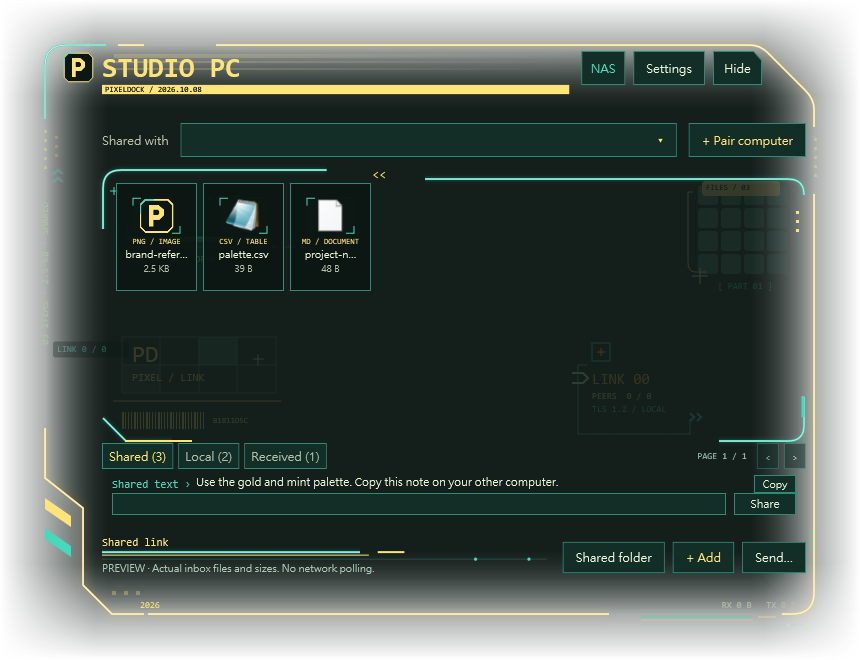

# PixelDock

**A free Windows desktop dock for sharing files and copyable text over your local network.**

[Read the illustrated English guide](https://jack7534.github.io/pixeldock/) · [Download PixelDock](https://github.com/jack7534/pixeldock/releases/latest)

## What it does

- Pair trusted Windows computers on the same private local network.
- Add files to Shared to synchronize copies automatically.
- Keep local file, folder and tool references in a separate Local area.
- Share short notes or links that other paired computers can read and copy.
- Delete files with a scope confirmation; synchronized Shared deletion requires every peer on 1.5.8.
- Customize six colors, neon glow and folding palette categories.
- Use an awake Windows computer as a shared-file hub.

## Get started

1. Download the Windows ZIP from Releases and extract it.
2. Run `PixelDock-Setup.exe` on each computer.
3. Open **+ Pair computer** and exchange the pairing code privately.
4. Add a file to **Shared**. Keep both apps running and verify the file on the other computer.

Windows with .NET Framework 4.7.2 or later in the 4.x family is required. The installer currently uses Chinese labels; the English guide includes translations.

## Documentation

The guide contains 13 chapters and 13 program views covering installation, pairing, file synchronization, local references, shared text, appearance, displays, Windows host mode and troubleshooting. The deletion confirmation is rendered from 1.5.8 using demonstration data; earlier appearance views show the unchanged 1.5.7 design.

[Markdown manual](PixelDock-User-Guide-1.5.8.md)

This repository contains the documentation website. The desktop application is distributed in Releases; its application source is not included here. Free use does not imply an open-source license.

## Keep in mind

PixelDock operates on a private IPv4 local network. It does not provide an Internet relay, install onto a NAS appliance, or replace an independent backup. In-app Shared deletions synchronize between 1.5.8 peers. Update every peer; Explorer deletions do not create synchronized deletion records. Local file deletion removes the original; use Remove from classification to keep it. Keep pairing codes private.
